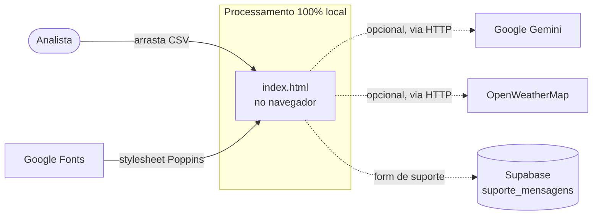

# Contexto e escopo

## Sumário

- [O que é](#o-que-é)
- [Para quem](#para-quem)
- [Fronteiras do sistema](#fronteiras-do-sistema)
- [Princípios de projeto (não negociáveis)](#princípios-de-projeto-não-negociáveis)
- [O que está fora de escopo](#o-que-está-fora-de-escopo)

## O que é

Dashboard analítico **single-file** para dados globais de consumo de álcool,
feito para a divisão **Nitro** de *Deixa Comigo Bebidas*. Todo o entregável vive
em `Dashboards/index.html` — HTML, CSS e JavaScript no mesmo arquivo, **sem build
step, sem gerenciador de pacotes e sem test runner**. Roda no navegador,
inclusive a partir de `file://`.

O usuário arrasta um CSV (o `Dados/drinks.csv` de exemplo ou outro no mesmo
formato) para a janela e o dashboard renderiza: cartões de estatística, mapa-múndi
coroplético, ranking, matriz de correlação, dispersão com regressão, histograma e
tabelas por continente e por país.

## Para quem

| Perfil | Uso |
| --- | --- |
| Analista de negócio Nitro | Abre o dashboard, solta a planilha, explora filtros e exporta insights visuais. |
| Engenharia Nitro | Mantém o `index.html`, os servidores locais e o deploy. |
| Suporte | Recebe mensagens do formulário via Supabase. |

## Fronteiras do sistema

- **Dentro**: parsing de CSV, estatística, projeção cartográfica, todos os painéis
  e a interação — tudo no navegador, sem enviar os dados da planilha para fora.
- **Fora, opcional**: chat Gemini e clima (só quando servido por HTTP e com chaves
  configuradas) e o formulário de suporte (Supabase).
- **Única dependência de rede sempre presente**: a folha de estilo do Google Fonts
  (fonte Poppins).

## Princípios de projeto (não negociáveis)

> [!IMPORTANT]
> Duas regras de UX vêm diretamente do cliente e não devem ser quebradas:
> 1. **Um gesto** — soltar a planilha basta; todo filtro nasce com "tudo selecionado".
> 2. **Nada de dado sai do navegador** — o rodapé promete processamento 100% local;
>    não há chamada de rede com os dados da planilha (as integrações mandam apenas
>    o recorte agregado, e só quando o usuário as aciona).

Ver as decisões que sustentam esses princípios em
[ADRs](../01-arquitetura/adr/README.md).

## O que está fora de escopo

- A pasta `Jornal/` é um subprojeto editorial (apuração e diagramação de um jornal),
  com skills próprias em `.claude/skills/`. Não faz parte do dashboard e é citada
  apenas de passagem em [integrações](../01-arquitetura/integracoes.md).
- Não há autenticação de usuário no dashboard; ele é anônimo e read-only sobre o
  CSV carregado localmente.

## Veja também

- [Hub da documentação](../README.md)
- [Stakeholders e fluxo de trabalho](stakeholders-e-fluxo.md)
- [Visão geral da arquitetura](../01-arquitetura/visao-geral.md)
- [Glossário](glossario.md)
