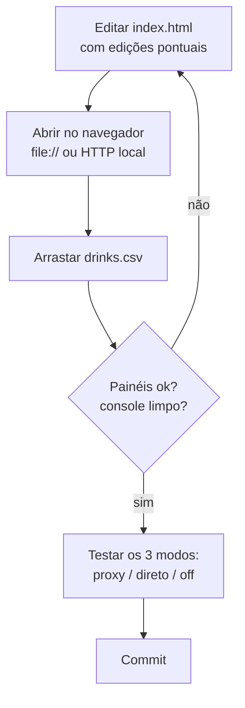

# Stakeholders e fluxo de trabalho

## Sumário

- [Quem usa e quem mantém](#quem-usa-e-quem-mantém)
- [Ciclo de trabalho no código](#ciclo-de-trabalho-no-código)
- [Ciclo do agente de documentação](#ciclo-do-agente-de-documentação)

## Quem usa e quem mantém

| Papel | Responsabilidade |
| --- | --- |
| Analista Nitro | Consome o dashboard; reporta problemas pelo formulário de suporte. |
| Engenharia Nitro | Evolui `index.html`, `server.mjs`, `serve.ps1`, o deploy Vercel e a migração Supabase. |
| Agente `documentador-site` | Mantém esta árvore de documentação (roda toda sexta às 14h). |
| Suporte / triagem | Lê `public.suporte_mensagens` no painel do Supabase. |

## Ciclo de trabalho no código

Não há repositório com CI de testes automatizados; a verificação é **manual e
visual** (ver [estratégia de testes](../05-qualidade/estrategia-de-testes.md)). O
fluxo típico de uma mudança:

> [!WARNING]
> `Dashboards/index.html` contém uma linha de ~100 KB (o TopoJSON inline na linha
> 983). **Nunca reescreva o arquivo inteiro com uma ferramenta de Write** — use
> edições pontuais, ou a linha do atlas será corrompida. Detalhe em
> [desempenho](../05-qualidade/desempenho.md).

## Ciclo do agente de documentação

O agente `documentador-site` roda semanalmente e opera em dois modos:

- **Modo A — há novidade**: documenta o que mudou e reconcilia o que ficou
  desatualizado.
- **Modo B — sem novidade**: aprofunda a documentação existente a partir do
  backlog em [`estado.md`](../_meta/estado.md).

O histórico de cada rodada fica em
[`historico-execucoes.md`](../_meta/historico-execucoes.md).

## Veja também

- [Contexto e escopo](contexto-e-escopo.md)
- [Estratégia de testes](../05-qualidade/estrategia-de-testes.md)
- [Estado da documentação](../_meta/estado.md)
- [Hub da documentação](../README.md)
