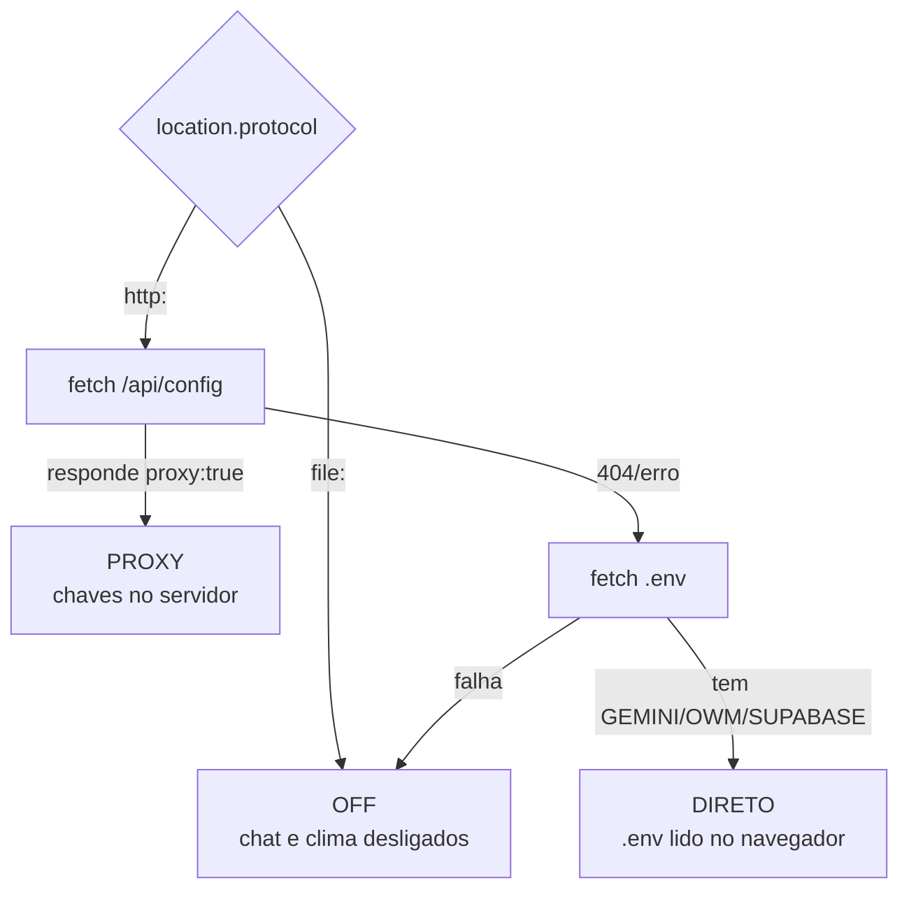
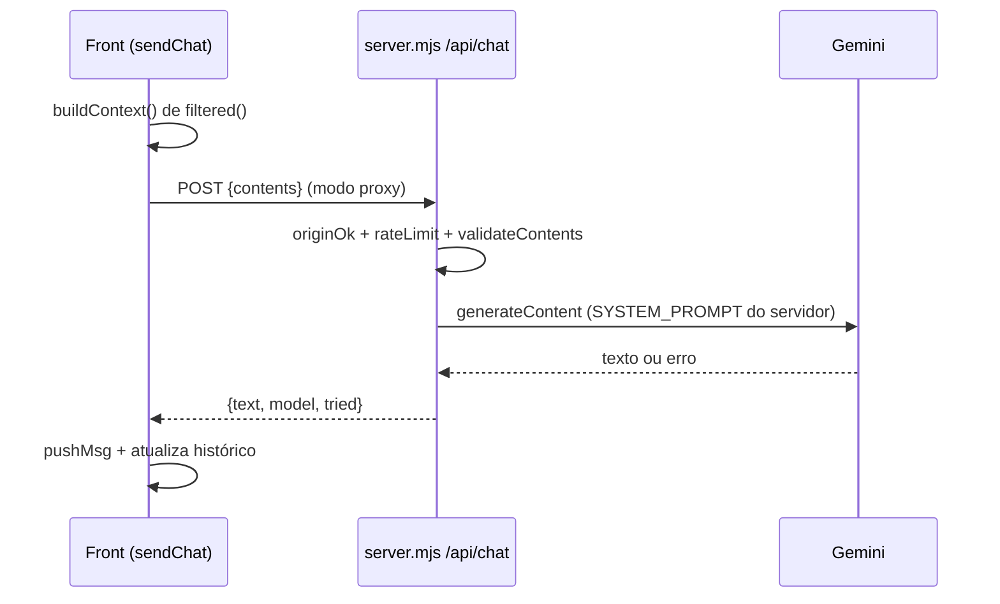

# Integrações externas

Três integrações opcionais vivem no fim do IIFE `boot()` de `index.html`, mais os
dois runtimes que as habilitam. Nenhuma quebra o dashboard se estiver
indisponível: o núcleo (parsing, painéis) funciona sempre.

## Sumário

- [Os três modos de runtime](#os-três-modos-de-runtime)
- [Chat com os dados (Gemini)](#chat-com-os-dados-gemini)
- [Clima (OpenWeatherMap)](#clima-openweathermap)
- [Formulário de suporte (Supabase)](#formulário-de-suporte-supabase)
- [Google Fonts](#google-fonts)
- [Subprojeto Jornal](#subprojeto-jornal)

## Os três modos de runtime

`bootConfig()` (`Dashboards/index.html:2152`) decide o modo em runtime, nesta ordem:

| Modo | Como surge | Chaves | Chat/Clima |
| --- | --- | --- | --- |
| **proxy** | `server.mjs` responde `/api/config` | ficam no servidor | via `/api/*` |
| **direto** | servido por HTTP estático (`serve.ps1`), `.env` legível | vão ao navegador | chamada direta a Google/OWM |
| **off** | aberto em `file://` | — | desligados com aviso |

> [!IMPORTANT]
> Ao mexer nessas features, **teste os três modos**. O objeto de config é `CFG`
> (`:2134`); os modelos-padrão são `DEFAULT_MODELS` (`:2150`).

## Chat com os dados (Gemini)

Botão na parte inferior central. Conversa sobre o **recorte filtrado**, nunca sobre
`S.rows` inteiro.

- **Contexto remontado a cada envio** por `buildContext()` (`:2288`) a partir de
  `filtered()` — é isso que faz o modelo respeitar os filtros. Inclui resumo de
  filtros, estatísticas, agregado por continente e até `MAX_ROWS_CTX` (220) linhas.
- **Histórico enxuto**: `CHAT.history` guarda só a pergunta limpa (sem o bloco de
  contexto) e fica em 12 turnos (`:2453`).
- **Recorte vazio é tratado**: o prompt manda avisar em vez de inventar número
  (`:2297`).
- **Prompt de sistema duplicado**: `SYSTEM_PROMPT` existe no cliente (`:2325`, usado
  só no modo direto) e no `server.mjs` (`:54`, usado no modo proxy). No proxy o
  cliente manda apenas `contents`; um `system` do corpo é ignorado.

> [!WARNING]
> Ao editar o prompt, **edite as duas cópias** (`index.html` e `server.mjs`), ou os
> dois modos respondem diferente.

- **Cadeia de fallback**: `GEMINI_MODELS` no `.env`, replicada em `DEFAULT_MODELS`
  (`index.html`) e no default de `MODELS` (`server.mjs:39`) — mantenha as três em
  sincronia. 404/408/409/429/5xx caem para o próximo modelo; 400/401/403 param a
  cadeia. Conjunto `RETRYABLE` em `:2358` (cliente) e `server.mjs:191`.
- **"Pensamento" dos modelos 3.x**: sem `thinkingConfig.thinkingLevel:"low"` e
  `maxOutputTokens` folgado (8192), a resposta volta **vazia** com
  `finishReason: MAX_TOKENS` (um HTTP 200 que parece sucesso). Um 400 mencionando
  `thinking` repete o mesmo modelo sem o campo (`:2396`).

No `server.mjs`, `/api/chat` exige origem própria (ou `ALLOWED_ORIGINS`), aplica
janela deslizante por IP e valida `contents` (turnos `user`/`model`, tetos de parts
e caracteres). Ver [configuração](../02-referencia/configuracao.md) e
[segurança](../05-qualidade/seguranca-e-privacidade.md).

## Clima (OpenWeatherMap)

Pílula na topbar. `initWeather()` (`:2216`) usa `navigator.geolocation` →
OpenWeatherMap (direto ou via `/api/weather`). Permissão negada ou falha de rede
apenas **não exibe** o widget (`.weather.on`); nunca quebra a topbar. Ícones por
família do código OWM em `weatherIcon()` (`:2206`).

## Formulário de suporte (Supabase)

O modal de suporte grava em `public.suporte_mensagens` via REST do Supabase
(`:2079`), usando a **publishable/anon key** (pública por design). Quem protege é a
**RLS**, que só autoriza INSERT. `enviado_em` é carimbado pelo banco (`now()`),
nunca pelo cliente. Sem Supabase configurado (`CFG.support` falso), o form mostra
aviso e não envia. Esquema completo em
[esquema Supabase](../03-dados/esquema-supabase.md).

## Google Fonts

Única chamada de rede **sempre presente**: a folha de estilo do Google Fonts
(Poppins). Não trafega dado da planilha.

## Subprojeto Jornal

A pasta `Jornal/` (`apuracao/`, `edicoes/`) e as skills
`.claude/skills/jornal-*` são um subprojeto editorial **separado** do dashboard.
Fora do escopo desta documentação; citado apenas para orientação.

## Veja também

- [Configuração](../02-referencia/configuracao.md)
- [Esquema Supabase](../03-dados/esquema-supabase.md)
- [Segurança e privacidade](../05-qualidade/seguranca-e-privacidade.md)
- [Ambiente local](../04-operacao/ambiente-local.md)
- [Hub da documentação](../README.md)
