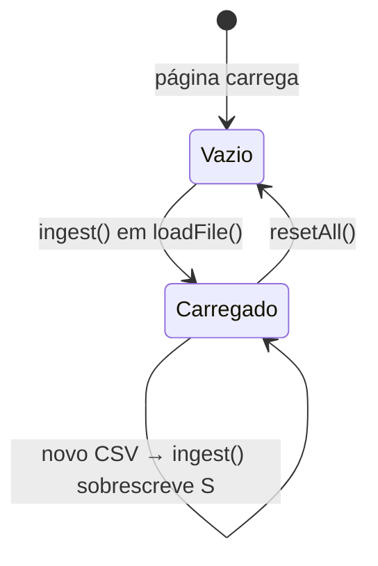

# Modelo de estado (objeto `S`)

Todo o estado do dashboard vive em **um único objeto `S`**, declarado em
`Dashboards/index.html:1149`. Não há framework, store nem reatividade: cada
handler muta `S` e chama `renderAll()`.

## Sumário

- [Campos](#campos)
- [Invariantes](#invariantes)
- [Estado "filtro vazio"](#estado-filtro-vazio)
- [Ciclo de vida](#ciclo-de-vida)

## Campos

```js
const S = {
  rows:[], fileName:"—", cols:{},
  metric:"total",
  conts:new Set(CONT_ORDER),
  countries:null,               // null = todos
  range:null, bounds:null,
  scale:"quantile", rank:"top",
  sx:"beer", sy:"wine",
  sortKey:"total", sortDir:-1,
  hi:null                       // país destacado
};
```

| Campo | Tipo | Significado |
| --- | --- | --- |
| `rows` | `Array<Registro>` | Linhas ingeridas e normalizadas. Cada registro: `{country, nk, geoKey, continent, total, beer, spirit, wine, _derived?}`. |
| `fileName` | `string` | Nome do arquivo carregado (exibido no rodapé). |
| `cols` | `object` | Mapa `chave da métrica → índice da coluna` detectado por `detectCols`. |
| `metric` | `"total"\|"beer"\|"spirit"\|"wine"` | Métrica ativa que dirige todos os painéis. |
| `conts` | `Set<string>` | Continentes selecionados (nomes em inglês de `CONT_ORDER`). |
| `countries` | `Set<string>\|null` | Chaves `nk` selecionadas. **`null` = todos**; `Set` vazio = nenhum. |
| `range` | `[lo,hi]\|null` | Corte numérico da faixa (slider dual) sobre a métrica ativa. |
| `bounds` | `[lo,hi]\|null` | Extremos da métrica no recorte base (alimenta o slider). |
| `scale` | `"quantile"\|"linear"` | Tipo de escala de cor do mapa. |
| `rank` | `"top"\|"bottom"` | Direção do painel de ranking. |
| `sx`, `sy` | `string` | Eixos X/Y do gráfico de dispersão (chaves de métrica). |
| `sortKey`, `sortDir` | `string`, `1\|-1` | Ordenação da tabela de dados. |
| `hi` | `string\|null` | Chave `nk` do país destacado (hover/clique cruzado entre painéis). |

## Invariantes

> [!IMPORTANT]
> - `S.countries === null` significa **todos os países** — não confundir com `Set`
>   vazio, que significa **nenhum**. Ambos são estados alcançáveis e legítimos.
> - `S.range` sempre fica dentro de `S.bounds` após `recomputeBounds()`
>   (`Dashboards/index.html:1320`): a faixa é reprojetada por `clamp`.
> - `S.metric` sempre é uma das quatro chaves de `METRICS`.
> - `S.conts` só contém continentes presentes no dataset carregado (definido em
>   `ingest`, `:1296`).

## Estado "filtro vazio"

Um recorte pode ficar **legitimamente vazio** (nenhum país selecionado, ou faixa
que exclui tudo). Isso **não é erro**: cada painel deve renderizar
"Sem dados no filtro atual." em vez de lançar exceção.

> [!WARNING]
> Ao adicionar um painel, trate `data.length === 0`. O contexto do chat também
> trata recorte vazio: `buildContext()` avisa o modelo em vez de mandar o dataset
> inteiro (`Dashboards/index.html:2295`).

## Ciclo de vida



> [!TIP]
> Ao testar o parser pelo console re-executando `ingest()`, ele muta `S.conts`,
> `S.countries`, `S.metric` e `S.fileName`. Restaurar só `S.rows` deixa
> `baseFiltered()` vazio e o dashboard parece quebrado — **resete `S` por
> inteiro**, depois `recomputeBounds(false); renderAll()`.

## Veja também

- [Pipeline de dados](pipeline-de-dados.md)
- [Funções de dados](../02-referencia/funcoes-de-dados.md)
- [Visão geral da arquitetura](visao-geral.md)
- [Hub da documentação](../README.md)
