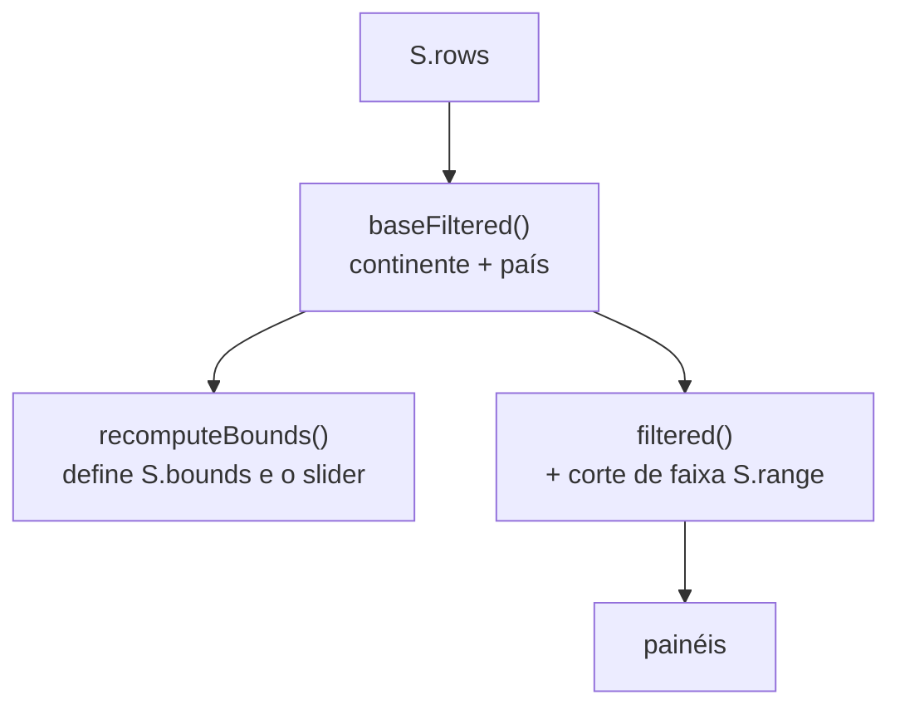

# Pipeline de dados

Do arquivo solto na janela até os painéis desenhados. Todas as etapas rodam no
navegador.

## Sumário

- [Visão do pipeline](#visão-do-pipeline)
- [Etapas](#etapas)
- [Detecção de colunas](#detecção-de-colunas)
- [Normalização e reconciliação de nomes](#normalização-e-reconciliação-de-nomes)
- [Derivação do total](#derivação-do-total)
- [Filtragem em dois estágios](#filtragem-em-dois-estágios)

## Visão do pipeline


Fonte: `Dashboards/index.html:1976` (`loadFile`). Limite de tamanho: 20 MB
(`:1978`), acima disso `fail("Arquivo maior que 20 MB.")`.

## Etapas

| Etapa | Função | Arquivo:linha | Saída |
| --- | --- | --- | --- |
| Ler arquivo | `loadFile` / `FileReader` | `:1976` | texto UTF-8 |
| Detectar delimitador | `sniff` | `:1097` | um de `, ; \t \|` |
| Tokenizar | `parseCSV` | `:1103` | matriz de células |
| Converter número | `toNum` | `:1121` | `number` ou `NaN` |
| Casar colunas | `detectCols` | `:1243` | `{country, total?, beer?, spirit?, wine?}` |
| Montar registros | `ingest` | `:1258` | `S.rows` + `{n, unmapped}` |
| Calcular limites | `recomputeBounds` | `:1320` | `S.bounds`, `S.range` |
| Renderizar | `renderAll` | `:1389` | DOM dos painéis |

## Detecção de colunas

`detectCols` (`Dashboards/index.html:1243`) casa cabeçalhos por regex do registro
`METRICS`, **percorrendo as métricas ao contrário** para que `total` seja casado
por último e não roube `beer_servings`:

```js
// país
let ci = H.findIndex(h=>/^(country|pais|país|nation|nome|name|territor)/i.test(h));
if(ci<0) ci = 0;                       // fallback: primeira coluna
cols.country = ci; used.add(ci);
// métricas — total por último para não roubar "beer_servings"
for(const m of METRICS.slice().reverse()){
  const i = H.findIndex((h,ix)=>!used.has(ix) && m.re.test(h));
  if(i>=0){ cols[m.key]=i; used.add(i); }
}
```

Se nenhuma coluna de consumo for reconhecida, `ingest` lança erro com o cabeçalho
lido (`:1264`).

## Normalização e reconciliação de nomes

O CSV **não tem coluna de continente**. Dois gazetteers embutidos resolvem isso,
ambos indexados por `norm()`:

- `CONT_RAW` (`:1010`) — país → continente.
- `ALIAS_RAW` (`:1020`) — nome do CSV → nome do atlas Natural Earth.

`norm()` (`:1041`) faz: strip de diacríticos (NFD), `&`→`and`, `St.`→`saint`,
pontuação→espaço, minúsculas. Cada registro ganha:

```js
const rec = { country, nk, geoKey: ALIAS[nk] || nk,
              continent: CONT_MAP[nk] || CONT_MAP[ALIAS[nk]] || "—" };
```

> [!WARNING]
> As chaves de alias devem ser escritas **na forma normalizada** —
> `"bosnia herzegovina"`, não `"bosnia-herzegovina"` — e o valor tem de ser um
> nome que exista no atlas 110m. O gazetteer é indexado por nomes em **inglês**;
> nomes de país em português caem no grupo "Sem mapeamento" (`continent === "—"`).
> Detalhe em [qualidade e validação](../03-dados/qualidade-e-validacao.md).

## Derivação do total

Quando a coluna de total está ausente mas há doses, `ingest` deriva o total (aprox.
OMS por dose) e marca `_derived` (`:1286`):

```js
if(rec.total==null && (rec.beer!=null||rec.spirit!=null||rec.wine!=null)){
  rec.total = +(((rec.beer||0)*0.0133+(rec.spirit||0)*0.0175+(rec.wine||0)*0.0155)).toFixed(2);
  rec._derived = true;
}
```

| Bebida | Litros de álcool puro por dose (aprox.) |
| --- | --- |
| Cerveja | 0,0133 |
| Destilado | 0,0175 |
| Vinho | 0,0155 |

## Filtragem em dois estágios



`baseFiltered()` (`:1306`) aplica continente + país e alimenta os limites do
slider; `filtered()` (`:1312`) acrescenta o corte numérico. Manter a divisão evita
que o slider redefina os próprios limites com o próprio corte.

## Veja também

- [Modelo de estado](modelo-de-estado.md)
- [Funções de dados](../02-referencia/funcoes-de-dados.md)
- [Dicionário de dados](../03-dados/dicionario-de-dados.md)
- [Qualidade e validação](../03-dados/qualidade-e-validacao.md)
- [Hub da documentação](../README.md)
