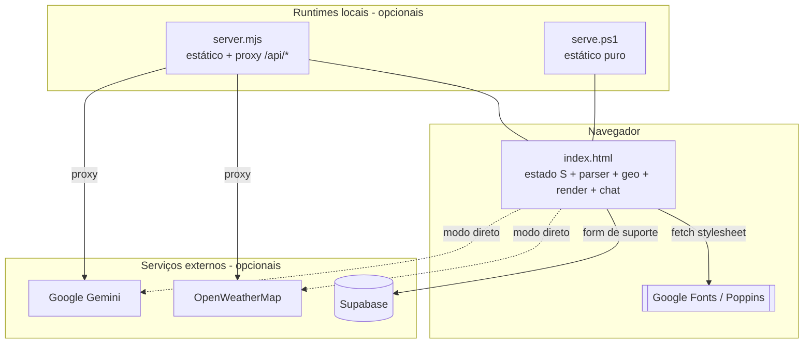
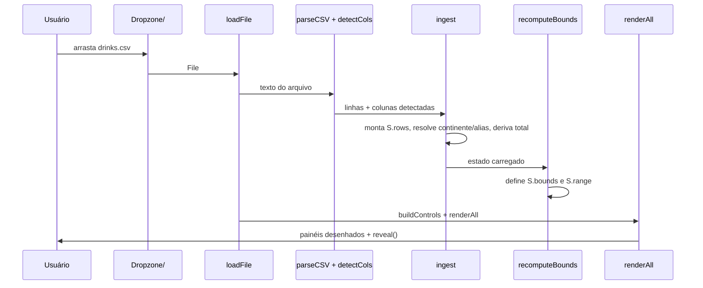

# Visão geral da arquitetura

## Sumário

- [Componentes](#componentes)
- [Fluxo principal](#fluxo-principal)
- [Camadas dentro de index.html](#camadas-dentro-de-indexhtml)
- [Acoplamentos deliberados](#acoplamentos-deliberados)

## Componentes

O coração é `Dashboards/index.html`. Os runtimes existem apenas para servir o
arquivo por HTTP (necessário para ler o `.env` e, no `server.mjs`, para manter as
chaves fora do navegador). Ver [integrações](integracoes.md) e
[ambiente local](../04-operacao/ambiente-local.md).

## Fluxo principal

Referência de código do fluxo: `Dashboards/index.html:1976` (`loadFile`) →
`parseCSV` (`:1103`) → `detectCols` (`:1243`) → `ingest` (`:1258`) →
`recomputeBounds` (`:1320`) → `renderAll` (`:1389`).

## Camadas dentro de index.html

| Camada | Responsabilidade | Símbolos-chave |
| --- | --- | --- |
| **Estado** | Fonte única de verdade | `const S` (`:1149`) |
| **Ingestão** | CSV → registros normalizados | `sniff`, `parseCSV`, `toNum`, `detectCols`, `ingest` |
| **Domínio geo** | TopoJSON → paths projetados | `topoDecode`, `equalEarth`, `fixAntimeridian`, `MAP_PATHS` |
| **Estatística** | Agregados e correlação | `stats`, `pearson`, `linreg` |
| **Filtros** | Recorte em dois estágios | `baseFiltered`, `filtered`, `recomputeBounds` |
| **Render** | Redraw completo por painel | `renderAll` + `render*` |
| **Controles** | Rail de filtros e interações | `buildControls`, `initMapInteractions`, `onDual` |
| **Integrações** | Config, clima, chat, suporte | `bootConfig`, `initWeather`, `sendChat`, form de suporte |

Detalhes: [pipeline de dados](pipeline-de-dados.md) e
[camada de apresentação](camada-de-apresentacao.md).

## Acoplamentos deliberados

- **Filtragem em dois estágios**: `baseFiltered()` (continente + país) alimenta os
  limites do slider; `filtered()` acrescenta o corte de faixa. Manter a separação
  ou o slider "briga consigo mesmo". Ver `Dashboards/index.html:1306`.
- **`METRICS` como registro único**: adicionar um tipo de bebida se faz lá, não em
  cada painel (`:1135`).
- **`CHAT_SYNC`**: ponteiro nulo até o boot que `renderAll()` chama para manter o
  resumo de filtros do chat em dia — o único acoplamento entre o núcleo e o chat
  (`:1388` e `:1403`).

Essas escolhas estão registradas como [ADRs](adr/README.md).

## Veja também

- [Modelo de estado](modelo-de-estado.md)
- [Pipeline de dados](pipeline-de-dados.md)
- [Camada de apresentação](camada-de-apresentacao.md)
- [Integrações externas](integracoes.md)
- [Hub da documentação](../README.md)
