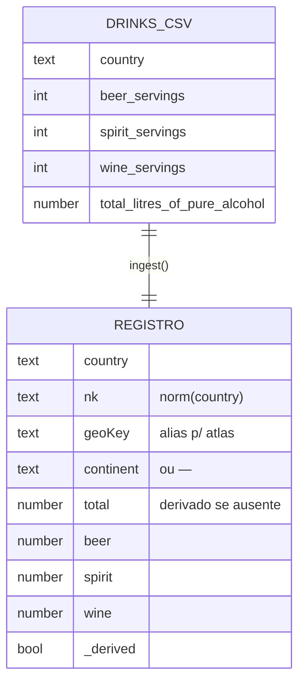

# Dicionário de dados

Descreve o dataset de exemplo `Dados/drinks.csv` (193 países + cabeçalho = 194
linhas) e o registro interno produzido por `ingest`.

## Sumário

- [Arquivo drinks.csv](#arquivo-drinkscsv)
- [Registro interno (S.rows)](#registro-interno-srows)
- [Como outros CSVs são aceitos](#como-outros-csvs-são-aceitos)

## Arquivo drinks.csv

Cabeçalho e amostra:

```csv
country,beer_servings,spirit_servings,wine_servings,total_litres_of_pure_alcohol
Afghanistan,0,0,0,0.0
Albania,89,132,54,4.9
Algeria,25,0,14,0.7
Andorra,245,138,312,12.4
```

| Coluna | Tipo | Domínio | Nulos | Observação |
| --- | --- | --- | --- | --- |
| `country` | texto | nome em inglês | não | chave de reconciliação via `norm()` |
| `beer_servings` | inteiro | ≥ 0 (doses/ano) | possíveis | `0` é válido (não é nulo) |
| `spirit_servings` | inteiro | ≥ 0 (doses/ano) | possíveis | — |
| `wine_servings` | inteiro | ≥ 0 (doses/ano) | possíveis | — |
| `total_litres_of_pure_alcohol` | decimal | ≥ 0 (litros/ano) | possíveis | se ausente, é **derivado** e marcado `_derived` |

> [!NOTE]
> Somente leitura: `Dados/drinks.csv` é referência, não deve ser editado como
> fonte de verdade — o dashboard aceita qualquer CSV no mesmo formato solto na
> janela.

## Registro interno (S.rows)

Cada linha vira um objeto (montado em `ingest`, `Dashboards/index.html:1277`):

| Campo | Origem |
| --- | --- |
| `country` | valor cru da coluna de país |
| `nk` | `norm(country)` — chave normalizada, também deduplica |
| `geoKey` | `ALIAS[nk] \|\| nk` — nome no atlas Natural Earth |
| `continent` | `CONT_MAP[nk] \|\| CONT_MAP[ALIAS[nk]] \|\| "—"` |
| `total`, `beer`, `spirit`, `wine` | `toNum` da coluna; `null` se ausente/inválido |
| `_derived` | `true` quando `total` foi calculado das doses |



## Como outros CSVs são aceitos

`detectCols` casa cabeçalhos por regex, então variações são toleradas:

| Espera reconhecer | Exemplos de cabeçalho |
| --- | --- |
| país | `country`, `pais`, `país`, `nation`, `nome`, `name`, `territor…` |
| total | `total_litres_of_pure_alcohol`, `pure alcohol`, `litros…` |
| cerveja | `beer`, `cerveja`, `bier` |
| destilados | `spirit`, `destilad…`, `liquor`, `licor`, `liqueur` |
| vinho | `wine`, `vinho`, `vin_…` |

Delimitador, aspas, BOM/CRLF e formatos numéricos são tolerados — ver
[qualidade e validação](qualidade-e-validacao.md).

## Veja também

- [Qualidade e validação](qualidade-e-validacao.md)
- [Pipeline de dados](../01-arquitetura/pipeline-de-dados.md)
- [Funções de dados](../02-referencia/funcoes-de-dados.md)
- [Hub da documentação](../README.md)
