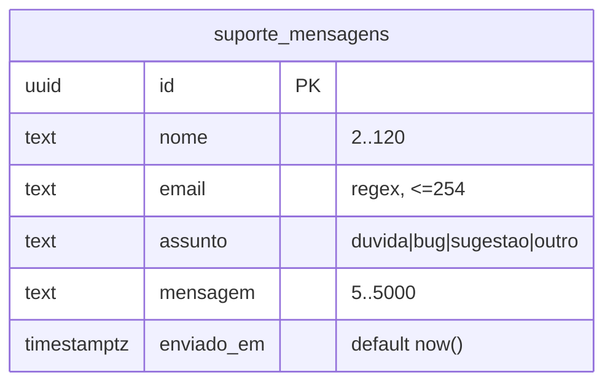

# Esquema Supabase

Persistência do formulário de suporte. Migração: `supabase/001_suporte_mensagens.sql`
(rodar uma vez no SQL Editor do Supabase).

## Sumário

- [Tabela suporte_mensagens](#tabela-suporte_mensagens)
- [Validação no schema](#validação-no-schema)
- [RLS](#rls)
- [Como o front escreve](#como-o-front-escreve)

## Tabela suporte_mensagens

| Coluna | Tipo | Regras |
| --- | --- | --- |
| `id` | `uuid` | PK, default `gen_random_uuid()` |
| `nome` | `text` | not null; 2–120 chars (após `btrim`) |
| `email` | `text` | not null; ≤ 254 chars; regex de e-mail |
| `assunto` | `text` | not null; default `'duvida'`; em `{duvida,bug,sugestao,outro}` |
| `mensagem` | `text` | not null; 5–5000 chars (após `btrim`) |
| `enviado_em` | `timestamptz` | not null; default `now()` — **carimbado pelo banco** |

As colunas espelham 1:1 os campos de `#supportForm` em `Dashboards/index.html`.
Índices: `enviado_em desc` (triagem por data) e `assunto`.



## Validação no schema

As checagens vivem no banco, não só no front — defesa em profundidade:

```sql
nome     text not null check (char_length(btrim(nome)) between 2 and 120),
email    text not null check (char_length(email) <= 254
                     and email ~* '^[^@[:space:]]+@[^@[:space:]]+\.[^@[:space:]]+$'),
assunto  text not null default 'duvida'
                     check (assunto in ('duvida','bug','sugestao','outro')),
mensagem text not null check (char_length(btrim(mensagem)) between 5 and 5000),
```

## RLS

> [!IMPORTANT]
> A segurança depende inteiramente da RLS estar ligada com **apenas** a policy de
> INSERT. Ver [ADR-0007](../01-arquitetura/adr/ADR-0007-supabase-rls-insert-only.md).

```sql
alter table public.suporte_mensagens enable row level security;
create policy "suporte: qualquer um pode enviar"
  on public.suporte_mensagens for insert to anon, authenticated with check (true);
revoke select, update, delete on public.suporte_mensagens from anon, authenticated;
grant  insert                 on public.suporte_mensagens to anon, authenticated;
```

Resultado: com a anon key, o público **grava e não lê/edita/apaga** nada (nem
mensagens de terceiros). Leitura fica para o painel Supabase / `service_role`.

## Como o front escreve

`Dashboards/index.html:2096` faz `POST` REST com a anon key
(`apikey` + `authorization: Bearer`), `prefer: return=minimal`, e **não** envia
`enviado_em`. Sem Supabase configurado (`CFG.support` falso), mostra aviso e não
envia (`:2089`).

## Veja também

- [ADR-0007 — Supabase RLS só de INSERT](../01-arquitetura/adr/ADR-0007-supabase-rls-insert-only.md)
- [Integrações externas](../01-arquitetura/integracoes.md)
- [Segurança e privacidade](../05-qualidade/seguranca-e-privacidade.md)
- [Configuração](../02-referencia/configuracao.md)
- [Hub da documentação](../README.md)
