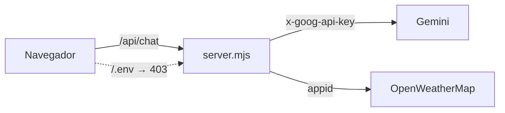

# Ambiente local

Como rodar o NitroDash na máquina: só o navegador, ou um dos dois servidores.

## Sumário

- [Pré-requisitos](#pré-requisitos)
- [Abrir sem servidor (file://)](#abrir-sem-servidor-file)
- [serve.ps1 (modo direto)](#serveps1-modo-direto)
- [server.mjs (modo proxy)](#servermjs-modo-proxy)
- [Qual usar](#qual-usar)

## Pré-requisitos

| Caminho | Requisito |
| --- | --- |
| `file://` | só um navegador |
| `serve.ps1` | Windows com PowerShell (HttpListener do .NET, já presente) |
| `server.mjs` | Node 18+ (usa `fetch` nativo; nenhum pacote instalado) |
| chat/clima | `.env` com as chaves (copie de `.env.example`) |
| suporte | `SUPABASE_URL` + `SUPABASE_ANON_KEY` e a migração aplicada |

```bash
cp .env.example .env
```

## Abrir sem servidor (file://)

```bash
start "" "Dashboards/index.html"
```

Arraste `Dados/drinks.csv` para a janela. Chat e clima ficam **desligados** (o
navegador bloqueia `fetch` do `.env`); o resto funciona igual — é a degradação
projetada, não um bug.

## serve.ps1 (modo direto)

```bash
powershell -ExecutionPolicy Bypass -File serve.ps1
```

Sobe em `http://localhost:8080/Dashboards/index.html`. Serve os estáticos **e o
próprio `.env`** — ou seja, as chaves chegam ao navegador (modo **direto**).
Aceitável em máquina do próprio analista. Porta: parâmetro `-Port` > `PORT` do
`.env` > 8080. Impede escapar da raiz do projeto (`serve.ps1:80`).

## server.mjs (modo proxy)

```bash
node server.mjs
```

Sobe na mesma URL, mas faz **proxy** de `/api/weather` e `/api/chat`: as chaves
ficam no processo e **nunca** chegam ao navegador; `/.env` responde 403
(`server.mjs:296`). É o modo **proxy**. Exige Node 18+.



## Qual usar

| Cenário | Escolha |
| --- | --- |
| Só explorar o dashboard | `file://` |
| Testar chat/clima local, máquina própria | `serve.ps1` |
| Chaves fora do navegador; espelhar o deploy | `server.mjs` |

> [!TIP]
> Ao mexer no chat/clima, teste os **três** modos (proxy, direto, off). Problemas
> comuns em [runbooks](runbooks.md).

## Veja também

- [Build e deploy](build-e-deploy.md)
- [Configuração](../02-referencia/configuracao.md)
- [Integrações externas](../01-arquitetura/integracoes.md)
- [Runbooks](runbooks.md)
- [Hub da documentação](../README.md)
