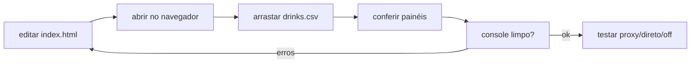

# Estratégia de testes

Não há test runner (ver
[ADR-0001](../01-arquitetura/adr/ADR-0001-single-file-zero-dependencia.md)). A
verificação é **manual e visual**, com o navegador como único loop real.

## Sumário

- [Loop de verificação](#loop-de-verificação)
- [Dirigindo o estado pelo console](#dirigindo-o-estado-pelo-console)
- [Roteiro mínimo por mudança](#roteiro-mínimo-por-mudança)
- [Dívida: ausência de testes automatizados](#dívida-ausência-de-testes-automatizados)

## Loop de verificação



Abrir por `file://` (`start "" "Dashboards/index.html"`) ou pelo Browser pane
navegando à URL `file://`. Para as integrações, servir por HTTP.

## Dirigindo o estado pelo console

O estado é global e manipulável:

```js
// carregar programaticamente
ingest(csvText, "teste.csv"); recomputeBounds(false); renderAll();

// exercitar filtros
S.metric = "beer"; recomputeBounds(false); renderAll();
S.countries = new Set();   // recorte vazio: painéis devem dizer "Sem dados…"
renderAll();
```

> [!WARNING]
> `ingest()` muta `S.conts`, `S.countries`, `S.metric`, `S.fileName` e outros.
> Restaurar só `S.rows` deixa `baseFiltered()` vazio e o dashboard parece quebrado.
> Resete `S` por inteiro antes de re-renderizar.

## Roteiro mínimo por mudança

- [ ] `drinks.csv` carrega; os 9 painéis renderizam; console sem erro.
- [ ] Trocar métrica (total/cerveja/destilados/vinho) atualiza tudo.
- [ ] Filtrar continente e país; mexer no slider de faixa.
- [ ] Recorte vazio mostra "Sem dados no filtro atual." (sem exceção).
- [ ] CSV alternativo (delimitador `;`, números pt-BR) ingere corretamente.
- [ ] Mudança em chat/clima: testar **proxy**, **direto** e **off**.
- [ ] Nenhuma animação deixa barra/ponto invisível.

## Dívida: ausência de testes automatizados

> [!NOTE]
> Funções puras como `parseCSV`, `toNum`, `stats`, `pearson`, `linreg`,
> `norm`, `equalEarth` e `fixAntimeridian` são candidatas naturais a testes
> unitários, mas hoje não há harness. Registrado como backlog em
> [`estado.md`](../_meta/estado.md). Um arquivo de teste separado violaria o
> single-file do entregável, mas poderia viver fora de `Dashboards/`.

## Veja também

- [Runbooks](../04-operacao/runbooks.md)
- [Qualidade e validação](../03-dados/qualidade-e-validacao.md)
- [Ambiente local](../04-operacao/ambiente-local.md)
- [Estado da documentação](../_meta/estado.md)
- [Hub da documentação](../README.md)
